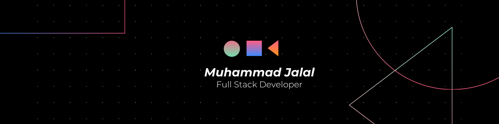

  

# 🚀 Muhammad Jalal | Full Stack & AI Automation Developer

Highly logical **Computer Science & Engineering** student at Daffodil International University and **Full Stack Developer**. I specialize in building high-scale web applications and autonomous AI systems using **Laravel**, **React**, and **AI Agent Orchestration (n8n/MCP)**.

### 🤖 What I'm currently focused on:
- **AI Automation:** Engineering agentic workflows and custom Prompt Engines to reduce operational costs.
- **Scalable Systems:** Building high-performance SPAs with **Inertia.js** and **Redis-backed** pipelines.
- **Modern WordPress:** Advanced custom plugin development and API-led architectural integrations.

---

### 🛠️ Tech Stack & Tools

#### 🧠 AI & Modern Workflow
 

#### 🌐 Backend & System Architecture

#### 🎨 Frontend & UI Development

#### 🚀 DevOps & Infrastructure

---

### 📂 Highlighted Projects

| Project | Stack | Highlights | Links |
|---|---|---|---|
| **RiceStream: Full-Stack ERP for Wholesale & Inventory Management** | Laravel, React.js, Inertia.js, MySQL, Tailwind CSS | Built a mission-critical ERP with Inertia.js modern monolith architecture for reactive UX and strong backend data integrity. Implemented high-precision financial logic (KG/Tonne conversions and automated double-entry dealer ledgers) with `bcmath` for zero-error dues.   **Key Achievements:** 100% financial accuracy; 70% less admin latency via automated Statements of Account; sub-200ms statement retrieval with optimized Eloquent + indexing; 30% faster inventory turnaround with valuation and low-stock alerts; 40% less frontend boilerplate through Inertia.js single source of truth. | [GitHub](https://github.com/shahjalal132/arod-management-system) |
| **AI-Powered Bilingual Content Compliance & QA Engine** | Laravel 13, Gemini 1.5 Flash (Structured Outputs), Redis, MySQL 8.0, AlpineJS, Tailwind CSS, PM2, Nginx | Engineered a high-throughput QA automation platform that pre-fetches and sanitizes HTML server-side, then audits URLs asynchronously through Redis Queues to avoid browser timeout bottlenecks. Added Gemini JSON Schema mode for deterministic bilingual (English/Welsh) structured outputs and automated reporting pipelines.   **Key Achievements:** 85% faster processing with support for 1,000+ URL bulk audits; 100% consistent structured data mapping and export integrity; dynamic prompt engine (CRUD) for non-technical rule tuning; 40% token cost reduction through payload cleaning/minification; production-ready LEMP + PM2 deployment automation. | [GitHub](https://github.com/shahjalal132/ai-qa-assistant-tool) |
| **Trading Chart: Full-Stack LMS & Affiliate Ecosystem** | Laravel, React.js, Inertia.js, Tailwind CSS, SSLCommerz, MySQL | Architected a SPA-style LMS and affiliate platform with secure server-side workflows, role-aware content protection, and referral commission automation. Integrated a centralized multi-domain SSLCommerz bridge for secure payment orchestration across multiple entry points.   **Key Achievements:** 2x faster navigation versus traditional MPA flow; centralized scalable multi-domain checkout; 50% less manual affiliate operations through automated tracking/payout logic; granular RBAC for students/instructors/affiliates; scalable course operations with bulk media handling and payment-triggered enrollments. | [Website](https://tradingchart.org/) |

---

### 📊 GitHub Activity & Stats

  
  

  

#### 📈 Contribution Graph

  

---

### 🤝 Connect with Me

